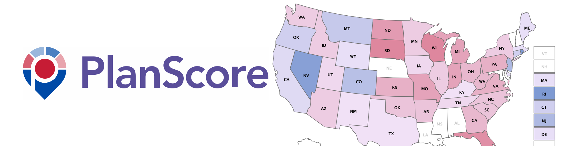

---
hide:
  - navigation

---

# Plenary Sessions

Our planned sessions include lightning talks, a workshop, two keynotes, and a social event.

## Lightning Talks

:calendar_spiral: Monday, July 24, 2023 @11:00am – 12:00pm PST

:material-video: See your Eventbrite email for the Zoom link

* Karen Majewicz - 10 things to know about OpenGeoMetadata Aardvark
* Eric Larson - GeoBlacklight Admin: An OGM Aardvark Workflow Application
* Eliot Jordan- New Data Formats for GeoBlacklight
* Stace Maples - What's going on in IIIF Maps

## Workshop

:calendar_spiral: Monday, July 24, 2023 @1:30pm – 3:00pm PST

:material-video: See your Eventbrite email for the Zoom link

### Introduction to Geospatial Raster and Vector Data with R

**Kristi Liu and Jon Jablonski**

This lesson covers how to open, work with, and plot vector and raster-format spatial data in R. Additional topics include working with spatial metadata (extent and coordinate reference systems), reprojecting spatial data, and working with raster time series data. [Preview the workshop here.](https://ucsb-dreamlab.github.io/r-raster-vector-geospatial/)

Before the workshop, please install the following: 

* [Download and install the latest version of R here](https://www.r-project.org/)
* [Download and install RStudio here](https://www.rstudio.com/)

In RStudio, go to Tools - Add Packages, and add the following packages: 

* tidyverse 
* dplyr
* sf
* terra

----------------------------------

## Keynotes

### Making Redistricting More Fair with PlanScore

:calendar_spiral: Tuesday, July 25, 2023 @1:30 PM PST

:material-video: [Open streaming link](https://stanford.zoom.us/j/98097384145?pwd=ekxnWk1qdnRsK3hQdENINGt2bFJnUT09)

**Michal Migurski** 

{ width="300"; align=right }
 
The 2020 decennial Census and its subsequent redistricting cycle was one of the most hotly contested line-drawing exercises in U.S. history. After a rapid series of overlapping legislative map proposals, accusations of gerrymandering, political lawsuits, arguments before the Supreme Court, and one nationwide mid-term Congressional election board member Michal Migurski will describe the creation and role of [PlanScore](https://planscore.org), a political science mapmaking project tackling the challenge of making redistricting fair and easy to understand.
  
::cards:: 

- title: Michal Migurski
  image: ../images/michal.jpg
  content: Michal Migurski is a co-creator of PlanScore.org, a head of data products at Felt.com, a former mapping team leader for Facebook, and a longtime champion of open geodata and the software tools to make it. His many past roles also include Remix.com, Code for America, and Stamen Design.
  
::/cards::

### Lessons and stories from the Conrad Collection on Dutch Waterways

:calendar_spiral: Wednesday, July 26, 2023 @9:30 AM PST

:material-video: [Open streaming link](https://stanford.zoom.us/j/96260137958?pwd=OWkvM0w0QWdqT1J3cFlENXpBNXM3QT09)

**Brynn Kramer**

In 1903, [Stanford Libraries purchased the personal library of J.F.W. Conrad](https://searchworks.stanford.edu/view/vt578hf4454), a renowned Dutch engineer who was a major contributor to hydraulic engineering, land reclamation, and canal infrastructure during the mid to late-19th century. For the next 116 years, some 2,500+ cartographic materials remained locked away until a project focusing on their digitization and cataloging began.  This talk will highlight some of the practices we have implemented to manage the workflow and just a few of the amazing maps and stories we discovered along the way.
    
::cards:: 

- title: Brynn Kramer
  image: ../images/kramer.jpg
  content: Brynn Kramer has been working as the Cartographic Project Metadata Librarian and Project Manager for the Conrad Collection on Dutch Waterways at Stanford University for the last year and half.  Within this role, she is responsible for cataloging, organizing and managing the digitization process of the collection. Prior to this, she worked as the Cataloging Assistant at the David Rumsey Map Center for three and half years where she cataloged rare maps and assisted with management of the collection.

::/cards::

----------------------------------

## Social Events

:calendar_spiral: Tuesday, July 25, 2023 @6:00 PM PST

::cards:: cols=2

- title: Pizza at the Farm
  image: ../images/farm.jpg
  content: Join us for wood-fired pizza and casual conversation at the [O'Donohue Family Stanford Educational Farm](https://farm.stanford.edu), Stanford's living laboratory for hands-on learning in sustainable agriculture.

::/cards::

