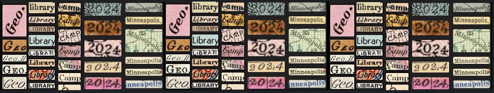

{ width=100% }
# Geo4LibCamp 2024: University of Minnesota Twin Cities - Minneapolis

!!! gbl inline "Info" 

	### :octicons-location-24: University of Minnesota Campus, Minneapolis, Minnesota
	### :octicons-calendar-24:  Monday, May 20 - Friday, 24, 2024
	* Main Sessions: Monday-Wednesday (Workshops, presentations, unconference sessions)
	* Optional Working Sessions: Thursday-Friday
	### Registration Cost: $150

## Conference Venue

Geo4LibCamp 2024 will be held at the University of Minnesota, Minneapolis campus. Our scheduled activities will take place in the [Elmer L. Andersen Library](https://www.lib.umn.edu/spaces/andersen), which is home to the University's Archives and Special Collections Department. Andersen Library is located at the western end of the Washington Avenue Pedestrian Bridge.

[Register for Geo4LibCamp 2024 :octicons-link-external-24:](https://learning.umn.edu/portal/events/reg/participantTypeSelection.do?method=load&entityId=45702457){ .md-button}

 

## Registration Fee 

The registration fee will be used to provide three catered lunches on Monday, Tuesday, and Wednesday. Attendees will also receive a complimentary event T-shirt.

## Accomodations

We are reserving a limited number of rooms in our conference hotel. 

!!! warning "Hotel reservation deadline" 

	Register by **April 29, 2024** to access the conference discount for reserved hotel blocks. The event discount code will be sent to you **after** you register for the conference.

**[Graduate Minneapolis, 615 Washington Ave SE](https://graduatehotels.com/minneapolis/)**

* 615 Washington Ave SE / Minneapolis, MN 55414
* Conference rate: $169 + tax per night
* Cutoff Date: 4/29/2024

## Travel

### Traveling by Plane

From the Minneapolis-St. Paul International Airport (MSP), light rail can bring you directly to the University:

**Airport to West Bank (Andersen Library and Courtyard by Marriott Hotel)** 

Depending upon how long you want to walk, do one of the following:

Option A

1. Take the northbound Blue Line light rail towards Minneapolis
2. Exit at the Cedar Riverside Station. 
3. Walk 0.5 miles to the Courtyard by Marriott or 0.7 miles from Andersen Library.

Option B

1. Take the northbound Blue Line light rail towards Minneapolis
2. Exit at U.S. Bank Stadium Station. 
3. Transfer to an eastbound Green Line and exit at the West Bank Station. 
4. Walk 0.03 miles (5 minutes) to either the Courtyard or the Library.

**Airport to East Bank (The Graduate Hotel)**

1. Take the northbound Blue Line light rail towards Minneapolis. 
2. Transfer at the U.S. Bank Stadium Station to an eastbound Green Line light rail towards St. Paul. 
3. Get off at the East Bank Station

### Traveling by Train

For those arriving by Amtrak’s Empire Builder, your stop will be at St. Paul’s Union Depot. From there, it’s straightforward to reach the campus:

1. Take a westbound Green Line light rail directly from Union Depot to the University of Minnesota
2. For the East Bank (The Graduate Hotel), exit at the East Bank Station. 
3. For West Bank destinations (Andersen Library and Marriott Hotel), continue one more stop to the West Bank Station.

### Traveling by Car

* From the North or South: Interstate 35W provides a direct route into Minneapolis, with named exits leading to the University of Minnesota.
* From the East or West: Interstate 94 is your best approach, offering exits that place you near the campus area.
* From the Southeast: Interstate 90 connects to Interstate 35W northbound, bringing you into Minneapolis about 90 minutes later.

### Getting around

The University’s Minneapolis campus is served by [Metro Transit](https://www.metrotransit.org) and campus buses. While campus is large, the conference venue is centrally located and is a 6-minute walk (0.3 miles) from the Courtyard by Marriott Minneapolis Downtown or a 19-minute walk (0.8 miles) from the Graduate Hotel.

## Local Guide

The University of Minnesota Twin Cities is one of the nation's top public research universities, with an award-winning library system to match.  Come visit the institution that invented the pacemaker, the retractable seat belt, and the Honeycrisp apple. Come meet library colleagues who launched the [BTAA Geoportal](https://geo.btaa.org), the [Mapping Prejudice Project](https://mappingprejudice.umn.edu), the [Data Curation Network](https://datacurationnetwork.org), and host the world's largest [transgender oral history archive](https://www.lib.umn.edu/collections/special/tretter/transgender-oral-history-project). Wherever your professional interests lie, you'll find your warm and dedicated counterparts here at the University of Minnesota.

Minneapolis is a vibrant and diverse city in the traditional homelands of the Dakota people, and is known for its parks, lakes, art museums, theater, food, and music venues. The Minneapolis-St. Paul International Airport (MSP) has been named the "Best Airport in North America" for the second straight year, and the city has great public transportation options. Ride our light rail from the airport directly to your hotel downtown, and immediately curbside to the conference venue on campus. 

#### Places to eat & drink near campus

*   [Al’s Breakfast](https://www.alsbreakfastmpls.com/) 
*   [Hard Times Cafe](https://www.facebook.com/hardtimescafe/)
*   [The Market at Malcolm Yards](https://malcolmyards.market/)
*   [Afro Deli](https://www.afrodeli.com)
*   [Surly Brewing Company](https://surlybrewing.com/)
*   [O'Shaughnessy Distilling Co.](https://osdistilling.com/home/)
*   [Palmer's Bar](https://palmers-bar.com/home)
*   [The Corner Bar](https://thecorner.bar)

#### Museums

**Within walking distance**

*   [Weisman Art Museum](https://wam.umn.edu/) (On campus)
*   [Mill City Museum](https://www.mnhs.org/millcity)

**On transport**

*   [Minneapolis Institute of Art](https://new.artsmia.org/exhibitions) (free, 2.6 miles, about 30 minutes on the 2 bus)
*   [Paisley Park](https://www.paisleypark.com/) Prince's home and studio (24 miles, 35 minutes by car)
*   [Walker Art Center](https://walkerart.org/) and sculpture garden (3.3 miles, 35 minute ride on the 2 bus)

#### Shopping

*   [Dinkytown](https://discoverthecities.com/dinkytown-minneapolis-guide/) (0.8 miles, about a 10 minute walk)
*   [Mall of America](https://www.mallofamerica.com/) (12 miles, hop the lightrail to get there in an hour - requires a transfer from the Green line downtown to the Blue line)