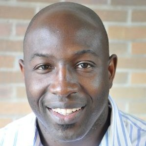

{ width=100% }
# Geo4LibCamp 2024: University of Minnesota Twin Cities - Minneapolis

!!! gbl inline "Info" 

	### :octicons-location-24: University of Minnesota Campus, Minneapolis, Minnesota
	### :octicons-calendar-24:  Monday, May 20 - Friday, 24, 2024
	* Main Sessions: Monday-Wednesday (Workshops, presentations, unconference sessions)
	* Optional Working Sessions: Thursday-Friday
	### Registration Cost: $150

## Conference Venue

Geo4LibCamp 2024 was held at the University of Minnesota, Minneapolis campus. Our scheduled activities took place in the [Elmer L. Andersen Library](https://www.lib.umn.edu/spaces/andersen), which is home to the University's Archives and Special Collections Department. Andersen Library is located at the western end of the Washington Avenue Pedestrian Bridge.

 

## Schedule

<table class="tg">
<thead>
  <tr>
    <th class="tg-g4tm"></th>
    <th class="tg-18eh">MONDAY 5/20</th>
    <th class="tg-wa1i">TUESDAY 5/21</th>
    <th class="tg-wa1i">WEDNESDAY 5/22</th>
    <th class="tg-wa1i">THURSDAY 5/23</th>
    <th class="tg-wa1i">FRIDAY 5/24</th>
  </tr>
</thead>
<tbody>
  <tr>
    <td class="tg-0a7q"></td>
    <td class="tg-wa1i">Main Conference Day 1</td>
    <td class="tg-wa1i">Main Conference Day 2</td>
    <td class="tg-wa1i">Main Conference Day 3</td>
    <td class="tg-wa1i">Optional Working Day 1</td>
    <td class="tg-wa1i">Optional Working Day 2</td>
  </tr>
  <tr>
    <td class="tg-0a7q">8:30 AM</td>
    <td class="tg-t45z">coffee/social time (30 min)</td>
    <td class="tg-t45z">coffee/social time (30 min)</td>
    <td class="tg-t45z">coffee/social time (30 min)</td>
    <td class="tg-t45z">coffee/social time (30 min)</td>
    <td class="tg-t45z">coffee/social time (30 min)</td>
  </tr>
  <tr>
    <td class="tg-cly1">9:00 AM</td>
    <td class="tg-u4xi">Welcome &amp; introductions</td>
    <td class="tg-hcdt">Keynote Talk with Dr. David Haynes</td>
    <td class="tg-oz2p">Unconference Session</td>
    <td class="tg-4ydh"><a href="https://geospatial.com">Field trip to East View Geospatial</a></td>
    <td class="tg-nc4f">Working Session</td>
  </tr>
  <tr>
    <td class="tg-cly1">9:30 AM</td>
    <td class="tg-u4xi"></td>
    <td class="tg-hcdt"></td>
    <td class="tg-oz2p"></td>
    <td class="tg-4ydh"> or Optional Working Session</td>
    <td class="tg-nc4f"></td>
  </tr>
  <tr>
    <td class="tg-cly1">10:00 AM</td>
    <td class="tg-u4xi"></td>
    <td class="tg-tdoa">break (30 min)</td>
    <td class="tg-oz2p"></td>
    <td class="tg-4ydh"></td>
    <td class="tg-nc4f"></td>
  </tr>
  <tr>
    <td class="tg-cly1">10:30 AM</td>
    <td class="tg-tdoa">break (30 min)</td>
    <td class="tg-hcdt">Lightning Talks</td>
    <td class="tg-tdoa">break (30 min)</td>
    <td class="tg-4ydh"></td>
    <td class="tg-tdoa">break (30 min)</td>
  </tr>
  <tr>
    <td class="tg-cly1">11:00 AM</td>
    <td class="tg-hcdt">Lightning Talks</td>
    <td class="tg-hcdt"></td>
    <td class="tg-oz2p">Unconference Session</td>
    <td class="tg-4ydh"></td>
    <td class="tg-nc4f">Working Session</td>
  </tr>
  <tr>
    <td class="tg-cly1">11:30 AM</td>
    <td class="tg-hcdt"></td>
    <td class="tg-hcdt"></td>
    <td class="tg-oz2p"></td>
    <td class="tg-4ydh"></td>
    <td class="tg-nc4f"></td>
  </tr>
  <tr>
    <td class="tg-cly1">12:00 PM</td>
    <td class="tg-tdoa">lunch (90 min)</td>
    <td class="tg-tdoa">lunch (90 min)</td>
    <td class="tg-tdoa">lunch (90 min)</td>
    <td class="tg-tdoa">lunch (90 min)</td>
    <td class="tg-tdoa">lunch (90 min)</td>
  </tr>
  <tr>
    <td class="tg-cly1">12:30 PM</td>
    <td class="tg-tdoa"></td>
    <td class="tg-tdoa"></td>
    <td class="tg-tdoa"></td>
    <td class="tg-tdoa"></td>
    <td class="tg-tdoa"></td>
  </tr>
  <tr>
    <td class="tg-cly1">1:00 PM</td>
    <td class="tg-tdoa"></td>
    <td class="tg-tdoa"></td>
    <td class="tg-tdoa"></td>
    <td class="tg-tdoa"></td>
    <td class="tg-tdoa"></td>
  </tr>
  <tr>
    <td class="tg-cly1">1:30 PM</td>
    <td class="tg-oz2p">Unconference Pitches and Planning</td>
    <td class="tg-oz2p">Unconference Session</td>
    <td class="tg-oz2p">Unconference Session</td>
    <td class="tg-nc4f">Working Session</td>
    <td class="tg-nc4f">Working Session</td>
  </tr>
  <tr>
    <td class="tg-cly1">2:00 PM</td>
    <td class="tg-oz2p"></td>
    <td class="tg-oz2p"></td>
    <td class="tg-oz2p"></td>
    <td class="tg-nc4f"></td>
    <td class="tg-nc4f"></td>
  </tr>
  <tr>
    <td class="tg-cly1">2:30 PM</td>
    <td class="tg-oz2p"></td>
    <td class="tg-oz2p"></td>
    <td class="tg-oz2p"></td>
    <td class="tg-nc4f"></td>
    <td class="tg-u4xi">Final Wrap-up Session</td>
  </tr>
  <tr>
    <td class="tg-cly1">3:00 PM</td>
    <td class="tg-tdoa">break (30 min)</td>
    <td class="tg-tdoa">break (30 min)</td>
    <td class="tg-tdoa">break (30 min)</td>
    <td class="tg-tdoa">break (30 min)</td>
    <td class="tg-u4xi"></td>
  </tr>
  <tr>
    <td class="tg-cly1">3:30 PM</td>
    <td class="tg-uqso">Workshops</td>
    <td class="tg-oz2p">Unconference Session</td>
    <td class="tg-oz2p">Unconference Session</td>
    <td class="tg-nc4f">Working Session</td>
    <td class="tg-ve35"></td>
  </tr>
  <tr>
    <td class="tg-cly1">4:00 PM</td>
    <td class="tg-uqso"></td>
    <td class="tg-oz2p"></td>
    <td class="tg-oz2p"></td>
    <td class="tg-nc4f"></td>
    <td class="tg-ve35"></td>
  </tr>
  <tr>
    <td class="tg-cly1">4:30 PM</td>
    <td class="tg-uqso"></td>
    <td class="tg-oz2p"></td>
    <td class="tg-u4xi">Main Conference Wrap-up Session</td>
    <td class="tg-nc4f"></td>
    <td class="tg-ve35"></td>
  </tr>
  <tr>
    <td class="tg-cly1">Evening</td>
    <td class="tg-4ydh">Informal social time - Happy hour</td>
    <td class="tg-4ydh">Group dinner at <a href="https://surlybrewing.com/beer-hall-and-beer-garden/">Surly Brewing</a></td>
    <td class="tg-4ydh">Informal social time - Happy hour</td>
    <td class="tg-4ydh"></td>
    <td class="tg-4ydh"></td>
  </tr>
</tbody>
</table>

## Keynote Speaker

### Bridging the Need Gap: Designing a Digital Social Care Referral Platform to Address Health-Related Social Needs

{ align=left } 

**Dr. David Haynes**

Assistant Professor; Institute for Health Informatics; Masters in GIS Faculty; Director of the [ISRDI Diversity Fellowship](https://isrdi.umn.edu/diversity-fellowship-program); University of Minnesota

Dr. Haynes is a broadly trained health geographer who uses spatial analysis methods to advance our knowledge of health and cancer disparities. He uses his GIScience and big geospatial computation expertise to understand spatial-temporal patterns of population health and cancer disparities. He also employs community-based participatory methods to develop Health Information Technology to answer substantive research questions about health disparities and cancer disparities.

 
	
## Workshops

Two workshops will be offered concurrently on the afternoon of Monday, May 20th. Choose one:

### GeoBlacklight for Beginners ---- Advanced GeoBlacklight: Voyaging Beyond Core

An introduction to the GeoBlacklight software with guided techniques for installation and customization. This workshop is for anyone interested in learning more about GeoBlacklight, including current and new users.

**Requirements**: To run GeoBlacklight locally, you will need the following:

* Ruby 
* Ruby on Rails
* Java - Apache Solr runs on Java 11 or greater.

Follow the [GoRails Setup](https://gorails.com/setup) steps to install a Ruby on Rails environment. [Homebrew](https://brew.sh/) can help you install Java on macOS or Windows Subsystem for Linux.

### Medley of Metadata Workflows

This workshop will provide a walkthrough of several techniques for creating and transforming geospatial metadata. We will cover methods ranging from from manual cataloging to batch harvesting and Python scripting. Participants will work with XML, JSON, and CSV formats, learning how to convert between ISO 191*, DCAT, and OGM Aardvark (GeoBlacklight) metadata frameworks.

**Requirements**. We will be using the following tools and libraries for this workshop:

* GDAL: https://pypi.org/project/GDAL/
* Jupyter Notebook: https://jupyter.org/install
* Pandas: https://pandas.pydata.org/getting_started.html

## Lightning Talks

### Monday

* Open-Source Georeferencing and Curating with Allmaps - Stephen Appel
* Blacklight::Allmaps Plugin - Eric Larson
* GeoServer and You: Or how I learned to stop worrying and ask Eliot to fix our ‘talk to GeoServer’ problems - Maura Carbone
* Ephemeral Geospatial Data: An Impending Dark Age - Karen Majewicz

 
### Tuesday

**Presentation:** Enhancing Access to Digital Aerial Photography at the University of Wisconsin-Madison - Jaime Martindale and Jim Lacy

**Lightning Talks**

1. OpenIndexMaps for 19th-century atlases of the upper Mississippi River - Owen Connolly
1. What is the National Geospatial Advisory Committee? - Ryan Mattke
1. The UC approach: Single code base, separate deployments - Amy Work and Tom Brittnacher
1. Using Aardvark to Drive Public Health Data Discovery - Adam Cox
1. Using Text Recognition to Georeference Aerial Photos?  - Kevin Dyke

## Registration Fee 

The registration fee will be used to provide three catered lunches on Monday, Tuesday, and Wednesday. Attendees will also receive a complimentary event T-shirt.

## Accomodations

We are reserving a limited number of rooms in our conference hotel. 

!!! warning "Hotel reservation deadline" 

	Register by **April 29, 2024** to access the conference discount for reserved hotel blocks. The event discount code will be sent to you **after** you register for the conference.

**[Graduate Minneapolis, 615 Washington Ave SE](https://graduatehotels.com/minneapolis/)**

* 615 Washington Ave SE / Minneapolis, MN 55414
* Conference rate: $169 + tax per night
* Cutoff Date: 4/29/2024

## Travel

### Traveling by Plane

From the Minneapolis-St. Paul International Airport (MSP), light rail can bring you directly to the University:

**Airport to West Bank (Andersen Library and Courtyard by Marriott Hotel)** 

Depending upon how long you want to walk, do one of the following:

Option A

1. Take the northbound Blue Line light rail towards Minneapolis
2. Exit at the Cedar Riverside Station. 
3. Walk 0.5 miles to the Courtyard by Marriott or 0.7 miles from Andersen Library.

Option B

1. Take the northbound Blue Line light rail towards Minneapolis
2. Exit at U.S. Bank Stadium Station. 
3. Transfer to an eastbound Green Line and exit at the West Bank Station. 
4. Walk 0.03 miles (5 minutes) to either the Courtyard or the Library.

**Airport to East Bank (The Graduate Hotel)**

1. Take the northbound Blue Line light rail towards Minneapolis. 
2. Transfer at the U.S. Bank Stadium Station to an eastbound Green Line light rail towards St. Paul. 
3. Get off at the East Bank Station

### Traveling by Train

For those arriving by Amtrak’s Empire Builder, your stop will be at St. Paul’s Union Depot. From there, it’s straightforward to reach the campus:

1. Take a westbound Green Line light rail directly from Union Depot to the University of Minnesota
2. For the East Bank (The Graduate Hotel), exit at the East Bank Station. 
3. For West Bank destinations (Andersen Library and Marriott Hotel), continue one more stop to the West Bank Station.

### Traveling by Car

* From the North or South: Interstate 35W provides a direct route into Minneapolis, with named exits leading to the University of Minnesota.
* From the East or West: Interstate 94 is your best approach, offering exits that place you near the campus area.
* From the Southeast: Interstate 90 connects to Interstate 35W northbound, bringing you into Minneapolis about 90 minutes later.

### Getting around

The University’s Minneapolis campus is served by [Metro Transit](https://www.metrotransit.org) and campus buses. While campus is large, the conference venue is centrally located and is a 6-minute walk (0.3 miles) from the Courtyard by Marriott Minneapolis Downtown or a 19-minute walk (0.8 miles) from the Graduate Hotel.

## Local Guide

The University of Minnesota Twin Cities is one of the nation's top public research universities, with an award-winning library system to match.  Come visit the institution that invented the pacemaker, the retractable seat belt, and the Honeycrisp apple. Come meet library colleagues who launched the [BTAA Geoportal](https://geo.btaa.org), the [Mapping Prejudice Project](https://mappingprejudice.umn.edu), the [Data Curation Network](https://datacurationnetwork.org), and host the world's largest [transgender oral history archive](https://www.lib.umn.edu/collections/special/tretter/transgender-oral-history-project). Wherever your professional interests lie, you'll find your warm and dedicated counterparts here at the University of Minnesota.

Minneapolis is a vibrant and diverse city in the traditional homelands of the Dakota people, and is known for its parks, lakes, art museums, theater, food, and music venues. The Minneapolis-St. Paul International Airport (MSP) has been named the "Best Airport in North America" for the second straight year, and the city has great public transportation options. Ride our light rail from the airport directly to your hotel downtown, and immediately curbside to the conference venue on campus. 

#### Places to eat & drink near campus

*   [Al’s Breakfast](https://www.alsbreakfastmpls.com/) 
*   [Hard Times Cafe](https://www.facebook.com/hardtimescafe/)
*   [The Market at Malcolm Yards](https://malcolmyards.market/)
*   [Afro Deli](https://www.afrodeli.com)
*   [Surly Brewing Company](https://surlybrewing.com/)
*   [O'Shaughnessy Distilling Co.](https://osdistilling.com/home/)
*   [Palmer's Bar](https://palmers-bar.com/home)
*   [The Corner Bar](https://thecorner.bar)

#### Museums

**Within walking distance**

*   [Weisman Art Museum](https://wam.umn.edu/) (On campus)
*   [Mill City Museum](https://www.mnhs.org/millcity)

**On transport**

*   [Minneapolis Institute of Art](https://new.artsmia.org/exhibitions) (free, 2.6 miles, about 30 minutes on the 2 bus)
*   [Paisley Park](https://www.paisleypark.com/) Prince's home and studio (24 miles, 35 minutes by car)
*   [Walker Art Center](https://walkerart.org/) and sculpture garden (3.3 miles, 35 minute ride on the 2 bus)

#### Shopping

*   [Dinkytown](https://discoverthecities.com/dinkytown-minneapolis-guide/) (0.8 miles, about a 10 minute walk)
*   [Mall of America](https://www.mallofamerica.com/) (12 miles, hop the lightrail to get there in an hour - requires a transfer from the Green line downtown to the Blue line)