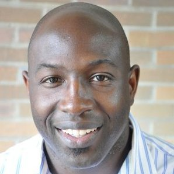

Our weeklong agenda will include workshops, lightning talks, a keynote, unconference sessions, and working sessions. 

## Schedule

<table class="tg">
<thead>
  <tr>
    <th class="tg-g4tm"></th>
    <th class="tg-18eh">MONDAY 5/20</th>
    <th class="tg-wa1i">TUESDAY 5/21</th>
    <th class="tg-wa1i">WEDNESDAY 5/22</th>
    <th class="tg-wa1i">THURSDAY 5/23</th>
    <th class="tg-wa1i">FRIDAY 5/24</th>
  </tr>
</thead>
<tbody>
  <tr>
    <td class="tg-0a7q"></td>
    <td class="tg-wa1i">Main Conference Day 1</td>
    <td class="tg-wa1i">Main Conference Day 2</td>
    <td class="tg-wa1i">Main Conference Day 3</td>
    <td class="tg-wa1i">Optional Working Day 1</td>
    <td class="tg-wa1i">Optional Working Day 2</td>
  </tr>
  <tr>
    <td class="tg-0a7q">8:30 AM</td>
    <td class="tg-t45z">coffee/social time (30 min)</td>
    <td class="tg-t45z">coffee/social time (30 min)</td>
    <td class="tg-t45z">coffee/social time (30 min)</td>
    <td class="tg-t45z">coffee/social time (30 min)</td>
    <td class="tg-t45z">coffee/social time (30 min)</td>
  </tr>
  <tr>
    <td class="tg-cly1">9:00 AM</td>
    <td class="tg-u4xi">Welcome &amp; introductions</td>
    <td class="tg-hcdt">Keynote Talk with Dr. David Haynes</td>
    <td class="tg-oz2p">Unconference Session</td>
    <td class="tg-4ydh"><a href="https://geospatial.com">Field trip to East View Geospatial</a></td>
    <td class="tg-nc4f">Working Session</td>
  </tr>
  <tr>
    <td class="tg-cly1">9:30 AM</td>
    <td class="tg-u4xi"></td>
    <td class="tg-hcdt"></td>
    <td class="tg-oz2p"></td>
    <td class="tg-4ydh"> or Optional Working Session</td>
    <td class="tg-nc4f"></td>
  </tr>
  <tr>
    <td class="tg-cly1">10:00 AM</td>
    <td class="tg-u4xi"></td>
    <td class="tg-tdoa">break (30 min)</td>
    <td class="tg-oz2p"></td>
    <td class="tg-4ydh"></td>
    <td class="tg-nc4f"></td>
  </tr>
  <tr>
    <td class="tg-cly1">10:30 AM</td>
    <td class="tg-tdoa">break (30 min)</td>
    <td class="tg-hcdt">Lightning Talks</td>
    <td class="tg-tdoa">break (30 min)</td>
    <td class="tg-4ydh"></td>
    <td class="tg-tdoa">break (30 min)</td>
  </tr>
  <tr>
    <td class="tg-cly1">11:00 AM</td>
    <td class="tg-hcdt">Lightning Talks</td>
    <td class="tg-hcdt"></td>
    <td class="tg-oz2p">Unconference Session</td>
    <td class="tg-4ydh"></td>
    <td class="tg-nc4f">Working Session</td>
  </tr>
  <tr>
    <td class="tg-cly1">11:30 AM</td>
    <td class="tg-hcdt"></td>
    <td class="tg-hcdt"></td>
    <td class="tg-oz2p"></td>
    <td class="tg-4ydh"></td>
    <td class="tg-nc4f"></td>
  </tr>
  <tr>
    <td class="tg-cly1">12:00 PM</td>
    <td class="tg-tdoa">lunch (90 min)</td>
    <td class="tg-tdoa">lunch (90 min)</td>
    <td class="tg-tdoa">lunch (90 min)</td>
    <td class="tg-tdoa">lunch (90 min)</td>
    <td class="tg-tdoa">lunch (90 min)</td>
  </tr>
  <tr>
    <td class="tg-cly1">12:30 PM</td>
    <td class="tg-tdoa"></td>
    <td class="tg-tdoa"></td>
    <td class="tg-tdoa"></td>
    <td class="tg-tdoa"></td>
    <td class="tg-tdoa"></td>
  </tr>
  <tr>
    <td class="tg-cly1">1:00 PM</td>
    <td class="tg-tdoa"></td>
    <td class="tg-tdoa"></td>
    <td class="tg-tdoa"></td>
    <td class="tg-tdoa"></td>
    <td class="tg-tdoa"></td>
  </tr>
  <tr>
    <td class="tg-cly1">1:30 PM</td>
    <td class="tg-oz2p">Unconference Pitches and Planning</td>
    <td class="tg-oz2p">Unconference Session</td>
    <td class="tg-oz2p">Unconference Session</td>
    <td class="tg-nc4f">Working Session</td>
    <td class="tg-nc4f">Working Session</td>
  </tr>
  <tr>
    <td class="tg-cly1">2:00 PM</td>
    <td class="tg-oz2p"></td>
    <td class="tg-oz2p"></td>
    <td class="tg-oz2p"></td>
    <td class="tg-nc4f"></td>
    <td class="tg-nc4f"></td>
  </tr>
  <tr>
    <td class="tg-cly1">2:30 PM</td>
    <td class="tg-oz2p"></td>
    <td class="tg-oz2p"></td>
    <td class="tg-oz2p"></td>
    <td class="tg-nc4f"></td>
    <td class="tg-u4xi">Final Wrap-up Session</td>
  </tr>
  <tr>
    <td class="tg-cly1">3:00 PM</td>
    <td class="tg-tdoa">break (30 min)</td>
    <td class="tg-tdoa">break (30 min)</td>
    <td class="tg-tdoa">break (30 min)</td>
    <td class="tg-tdoa">break (30 min)</td>
    <td class="tg-u4xi"></td>
  </tr>
  <tr>
    <td class="tg-cly1">3:30 PM</td>
    <td class="tg-uqso">Workshops</td>
    <td class="tg-oz2p">Unconference Session</td>
    <td class="tg-oz2p">Unconference Session</td>
    <td class="tg-nc4f">Working Session</td>
    <td class="tg-ve35"></td>
  </tr>
  <tr>
    <td class="tg-cly1">4:00 PM</td>
    <td class="tg-uqso"></td>
    <td class="tg-oz2p"></td>
    <td class="tg-oz2p"></td>
    <td class="tg-nc4f"></td>
    <td class="tg-ve35"></td>
  </tr>
  <tr>
    <td class="tg-cly1">4:30 PM</td>
    <td class="tg-uqso"></td>
    <td class="tg-oz2p"></td>
    <td class="tg-u4xi">Main Conference Wrap-up Session</td>
    <td class="tg-nc4f"></td>
    <td class="tg-ve35"></td>
  </tr>
  <tr>
    <td class="tg-cly1">Evening</td>
    <td class="tg-4ydh">Informal social time - Happy hour</td>
    <td class="tg-4ydh">Group dinner at <a href="https://surlybrewing.com/beer-hall-and-beer-garden/">Surly Brewing</a></td>
    <td class="tg-4ydh">Informal social time - Happy hour</td>
    <td class="tg-4ydh"></td>
    <td class="tg-4ydh"></td>
  </tr>
</tbody>
</table>

## Keynote Speaker

### Bridging the Need Gap: Designing a Digital Social Care Referral Platform to Address Health-Related Social Needs

{ align=left } 

**Dr. David Haynes**

Assistant Professor; Institute for Health Informatics; Masters in GIS Faculty; Director of the [ISRDI Diversity Fellowship](https://isrdi.umn.edu/diversity-fellowship-program); University of Minnesota

Dr. Haynes is a broadly trained health geographer who uses spatial analysis methods to advance our knowledge of health and cancer disparities. He uses his GIScience and big geospatial computation expertise to understand spatial-temporal patterns of population health and cancer disparities. He also employs community-based participatory methods to develop Health Information Technology to answer substantive research questions about health disparities and cancer disparities.

 
	
## Workshops

Two workshops will be offered concurrently on the afternoon of Monday, May 20th. Choose one:

### GeoBlacklight for Beginners ---- Advanced GeoBlacklight: Voyaging Beyond Core

An introduction to the GeoBlacklight software with guided techniques for installation and customization. This workshop is for anyone interested in learning more about GeoBlacklight, including current and new users.

**Requirements**: To run GeoBlacklight locally, you will need the following:

* Ruby 
* Ruby on Rails
* Java - Apache Solr runs on Java 11 or greater.

Follow the [GoRails Setup](https://gorails.com/setup) steps to install a Ruby on Rails environment. [Homebrew](https://brew.sh/) can help you install Java on macOS or Windows Subsystem for Linux.

### Medley of Metadata Workflows

This workshop will provide a walkthrough of several techniques for creating and transforming geospatial metadata. We will cover methods ranging from from manual cataloging to batch harvesting and Python scripting. Participants will work with XML, JSON, and CSV formats, learning how to convert between ISO 191*, DCAT, and OGM Aardvark (GeoBlacklight) metadata frameworks.

**Requirements**. We will be using the following tools and libraries for this workshop:

* GDAL: https://pypi.org/project/GDAL/
* Jupyter Notebook: https://jupyter.org/install
* Pandas: https://pandas.pydata.org/getting_started.html

## Lightning Talks

### Monday

* Open-Source Georeferencing and Curating with Allmaps - Stephen Appel
* Blacklight::Allmaps Plugin - Eric Larson
* GeoServer and You: Or how I learned to stop worrying and ask Eliot to fix our ‘talk to GeoServer’ problems - Maura Carbone
* Ephemeral Geospatial Data: An Impending Dark Age - Karen Majewicz

 
### Tuesday

**Presentation:** Enhancing Access to Digital Aerial Photography at the University of Wisconsin-Madison - Jaime Martindale and Jim Lacy

**Lightning Talks**

1. OpenIndexMaps for 19th-century atlases of the upper Mississippi River - Owen Connolly
1. What is the National Geospatial Advisory Committee? - Ryan Mattke
1. The UC approach: Single code base, separate deployments - Amy Work and Tom Brittnacher
1. Using Aardvark to Drive Public Health Data Discovery - Adam Cox
1. Using Text Recognition to Georeference Aerial Photos?  - Kevin Dyke

