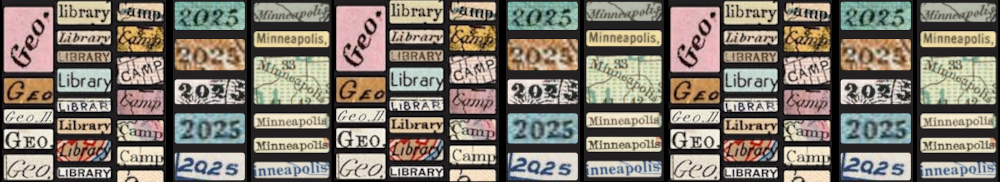

{ width=100% }

# Geo4LibCamp 2025: University of Minnesota Twin Cities - Minneapolis

!!! warning "Deadline to Register"
    Register by April 21, 2025! [Registration Form](https://learning.umn.edu/portal/events/reg/participantTypeSelection.do?method=load&entityId=54713343)

!!! gbl inline "Info"
    ### :octicons-location-24: University of Minnesota Campus, Minneapolis, Minnesota
    ### :octicons-calendar-24: Monday, May 19 - Friday, May 23, 2025
    * Main Sessions: Tuesday–Thursday (Presentations & unconference sessions)
    * Optional Co-working: Monday & Friday
    ### :material-form-select: [Register Here](https://learning.umn.edu/portal/events/reg/participantTypeSelection.do?method=load&entityId=54713343)
    ### :fontawesome-solid-dollar-sign: Registration Fee: $175

---

## Conference Venue
Geo4LibCamp 2025 will be held at the [Elmer L. Andersen Library](https://www.lib.umn.edu/spaces/andersen) on the University of Minnesota's Minneapolis campus. The library houses the University Archives and Special Collections and is located at the west end of the Washington Avenue Pedestrian Bridge.

## Registration
Complete the [registration form](https://learning.umn.edu/portal/events/reg/participantTypeSelection.do?method=load&entityId=54713343) through the University of Minnesota system. Registration includes lunches and snacks throughout the event.

- Fee: $175
- Deadline: April 21, 2025

## Accommodations
We have a room block reserved at the:
[Courtyard by Marriott](https://www.marriott.com/en-us/hotels/mspdc-courtyard-minneapolis-downtown/overview/)

- 1500 Washington Ave S, Minneapolis, MN 55454
- Rate: $149 + tax per night
- Reservation deadline: April 21, 2025

!!! warning "Hotel Booking Reminder"
    The hotel discount code will be shared with attendees after registration is complete.

## Schedule at a Glance
### Optional Days
- Monday, May 19: Pre-conference co-working (unstructured)
- Friday, May 23: Field trip or co-working time

### Main Sessions

<table border="1" cellpadding="6" cellspacing="0">
  <thead>
    <tr>
      <th>Time</th>
      <th>Tuesday May 20</th>
      <th>Wednesday May 21</th>
      <th>Thursday May 22</th>
    </tr>
  </thead>
  <tbody>
    <tr>
      <td>8:30 AM</td>
      <td colspan="3">Coffee / social time (30 min)</td>
    </tr>
    <tr>
      <td>9:00 AM</td>
      <td>Welcome & introductions</td>
      <td rowspan="3">Panel / Workshops</td>
      <td rowspan="2">Keynote: Michael Corey</td>
    </tr>
    <tr>
      <td>9:30 AM</td>
      <td>Unconference overview</td>
    </tr>
    <tr>
      <td>10:00 AM</td>
      <td>Project presentations</td>
      <td>TBD</td>
    </tr>
    <tr>
      <td>10:45 AM</td>
      <td colspan="3">Morning break or overflow time</td>
    </tr>
    <tr>
      <td>11:00 AM</td>
      <td>Lightning talks</td>
      <td>Lightning talks</td>
      <td>Panel</td>
    </tr>
    <tr>
      <td>11:30 AM</td>
      <td colspan="3">Unconference pitches</td>
    </tr>
    <tr>
      <td>12:00–1:00 PM</td>
      <td colspan="3">Lunch</td>
    </tr>
    <tr>
      <td>1:30–3:00 PM</td>
      <td  colspan="3">Unconference sessions</td>
    </tr>
    <tr>
      <td>3:00 PM</td>
      <td colspan="3">Afternoon break</td>
    </tr>
    <tr>
      <td>3:30–4:30 PM</td>
      <td  colspan="3">Unconference sessions</td>
    </tr>
    <tr>
      <td>4:30 PM</td>
      <td>Group discussion</td>
      <td>Group discussion</td>
      <td>Group discussion & wrap-up</td>
    </tr>
  </tbody>
</table>

!!! info "Want More Details?"
    See the [Sessions & Themes page](sessions.md) and the [Detailed Agenda](agenda.md).

## Traveling to the Conference
### By Air
Take the Blue Line light rail from MSP airport. For the West Bank area: Exit at Cedar Riverside and walk 0.5–0.7 miles OR Transfer to the Green Line at U.S. Bank Stadium and exit at West Bank.

### By Train
From Amtrak's Union Depot in St. Paul, take the Green Line west to West Bank Station.

### By Car
- **From North/South:** I-35W
- **From East/West:** I-94
- **From Southeast:** I-90 to I-35W

### Getting Around
- **Walk:** Campus and hotel are within a 6-minute walk
- **Bus:** Metro Transit and free campus shuttles serve the area
- **Bike:** Minneapolis has bike lanes, public e-bikes, and scooters
- **Light Rail:** Green Line connects downtown Minneapolis, campus, and St. Paul

## Local Guide

The University of Minnesota Twin Cities is one of the nation's top public research universities, with an award-winning library system to match.  Come visit the institution that invented the pacemaker, the retractable seat belt, and the Honeycrisp apple. Meet library colleagues who launched the [BTAA Geoportal](https://geo.btaa.org), the [Mapping Prejudice Project](https://mappingprejudice.umn.edu), the [Data Curation Network](https://datacurationnetwork.org), and who host the world's largest [transgender oral history archive](https://www.lib.umn.edu/collections/special/tretter/transgender-oral-history-project). Wherever your professional interests lie, you'll find dedicated and welcoming counterparts here at the University of Minnesota.

Minneapolis is a vibrant, diverse city located on the traditional homelands of the Dakota people. Known for its parks, lakes, museums, theaters, food, and music scene, the city offers plenty to explore. 

### Nearby Places to Eat & Drink
- [Al's Breakfast](https://www.alsbreakfastmpls.com/)
- [Hard Times Cafe](https://www.facebook.com/hardtimescafe/)
- [Malcolm Yards Market](https://malcolmyards.market/)
- [Afro Deli](https://www.afrodeli.com)
- [Surly Brewing Co.](https://surlybrewing.com/)
- [Palmer's Bar](https://palmers-bar.com/home)
- [The Corner Bar](https://thecorner.bar)

### Museums
**Walking distance:**
- [Weisman Art Museum](https://wam.umn.edu/)
- [Mill City Museum](https://www.mnhs.org/millcity)

**Accessible via transit:**
- [Minneapolis Institute of Art](https://new.artsmia.org/exhibitions)
- [Paisley Park](https://www.paisleypark.com/)
- [Walker Art Center](https://walkerart.org/)

### Shopping
- [Dinkytown](https://discoverthecities.com/dinkytown-minneapolis-guide/)
- [Mall of America](https://www.mallofamerica.com/) (via Blue Line)