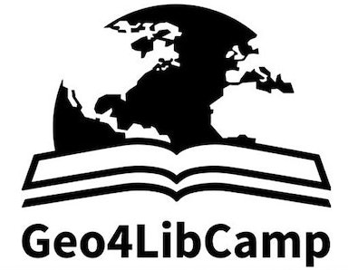

---
hide:
  - navigation
  - toc

---

  The next Geo4LibCamp will be June 8-12, 2026 hosted at the University of Texas at Austin

  

    
  

  

    <h1>Welcome to Geo4LibCamp</h1>
    
An informal, hands-on gathering for professionals working with geospatial resources in libraries.

  

  

    <h3><a href="about/">About Geo4LibCamp</a></h3>
    
Learn about our mission, history, and the community behind this event.

  

  

    <h3><a href="past-events/">Past Events</a></h3>
    
Explore sessions and materials from past Geo4LibCamp events.

  

  

    <h3><a href="glossary/">Glossary</a></h3>
    
New to the field? Brush up on our lingo with a handy glossary.

  

	
	
	

