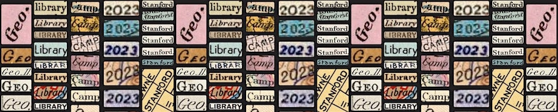

---
hide:
  - navigation
  - toc

---

{ width=100%}

 

{ align=left width=300px}

# Join us at the 8th Annual Geo4LibCamp
*The annual conference for librarians & library technologists working with or supporting the use of maps and spatial data.*

:octicons-calendar-24: July 24 -28, 2023 (8:30am-5pm PDT)

:octicons-location-24: Stanford University, Palo Alto, California
	

 
[Register on Eventbrite :octicons-link-external-24:](https://www.eventbrite.com/e/geo4libcamp-2023-tickets-643151833447){ .md-button } 

<!--[View the tentative 2023 Agenda](2023/agenda.md)
[Read more about Geo4LibCamp](about.md)-->

	
	
	

